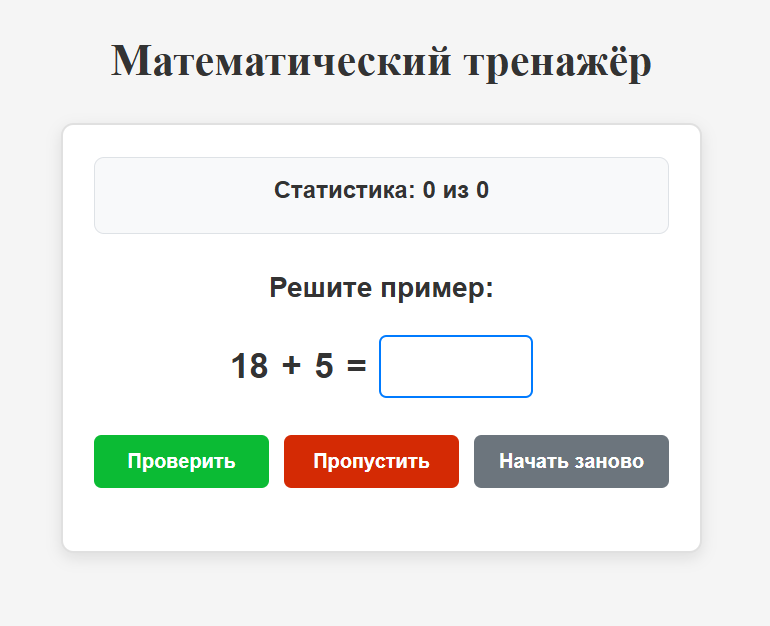
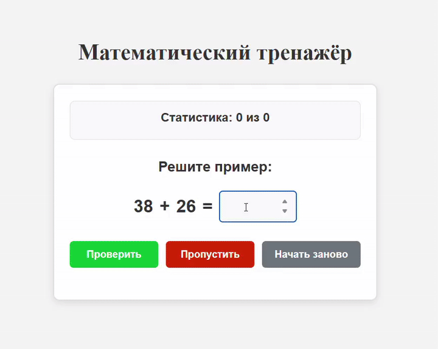
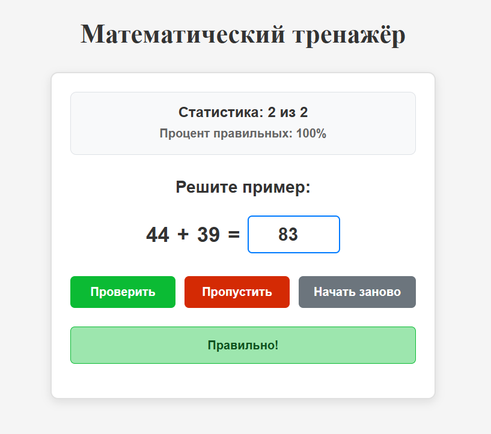
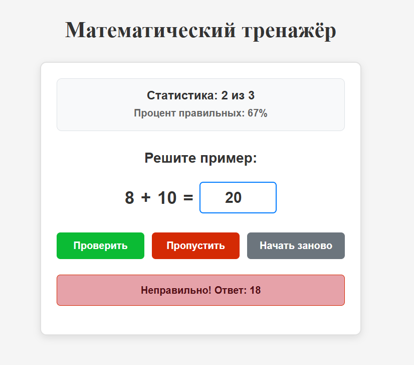

# 🧮 Математический тренажёр

---

React-приложение для тренировки навыков сложения.

---

## 🎥 Демонстрация



---

## 🖼️ Скриншоты




---

## 🚀 Функции

- Генерация случайных примеров на сложение
- Проверка введённых ответов
- Подсчёт статистики правильных ответов
- Автоматический переход к следующему примеру

---

## 🛠 Технологии

- React
- JSX
- CSS
- JavaScript

---

## 📦 Запуск

### Быстрый запуск dev версии через cmd для разработки

```bash
npm run dev
```

---

### 🧮 Математический тренажёр на GitHub Pages

[Публичная страница на GitHub Pages](https://dmchfast.github.io/react-project/)

---

## Ещё больше информации
- React + Vite, информация тут -> [`REACT+VITE.md`](./REACT+VITE.md)
- Как запустить проект, информация тут -> [`WORK.md`](./WORK.md)
